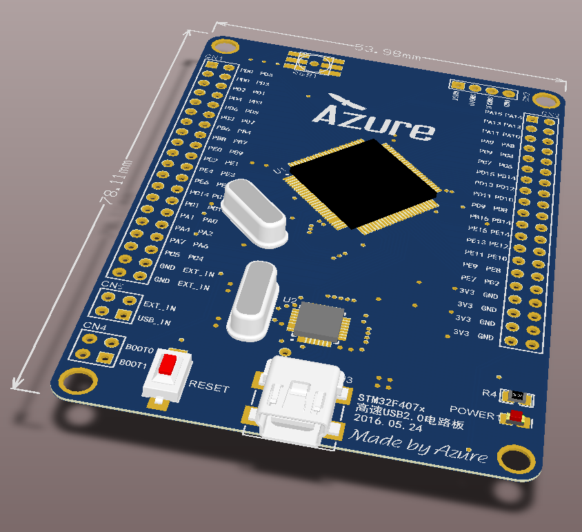
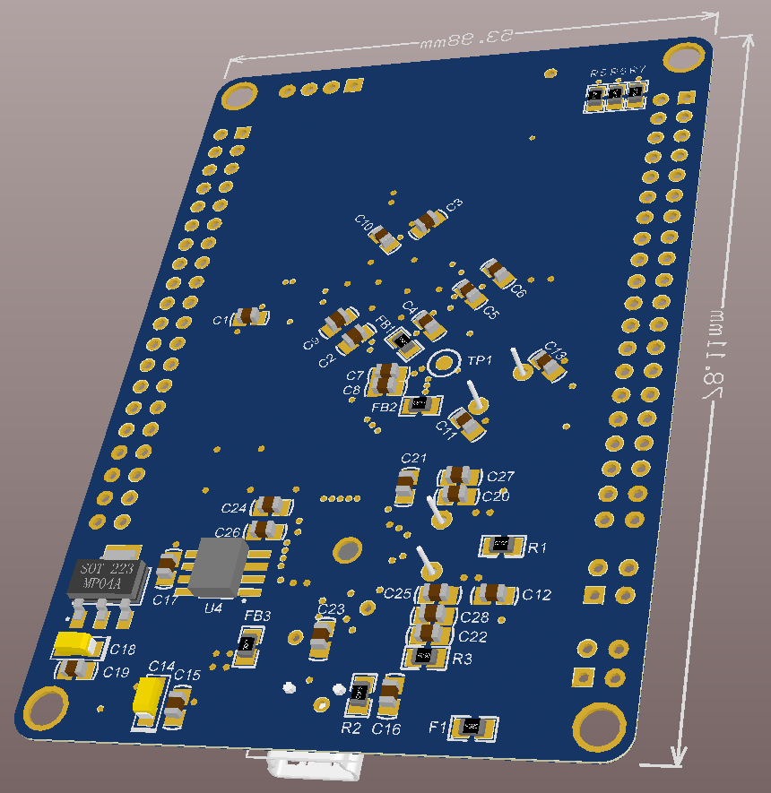

## uDSO是什么？
这是一个基于Qt的虚拟示波器软件，通过USB2.0与采样设备进行通信，目前使用STM32F407VET作为采样设备主控芯片，STM32F407VET直接控制高速ADC(AD9280)进行采样，后面计划可能会改用其它芯片（例如FPGA、LPC4370等），计划会推出android版本...

## uDSO有什么功能？
- 示波器
- 逻辑分析仪
- 信号发生器
- 等等（还在开发中）

## uDSO能用来干什么？
- 便携的数字示波器，虚拟示波器
- 替代传统数字示波器（虽然这是不可能，但是梦想还是要有的，万一哪天实现了呢）
- ...
- ...

## 关于 uDSO
* 这是一个长期开发和更新的项目，不会有明确的更新时间和终止期限，uDSO 开源、自由、跨平台（Linux/Windows）！
* 公布所有源代码，以及采样设备的原理图和PCB文件（假如这些东西都能被公开的话）...

#### 软件运行截图
Windows10 系统下

Windows10 系统下

#### 硬件电路效果图
电路效果图（正面）

电路效果图（背面）

## TODO
### 现有问题：
- 还没有完成第一版程序，源代码未上传公开（没东西说个... X_X）
- 还没有完成第一版电路设计，硬件还未开始调试，PCB未上传公开，硬件是短腿（没东西说个... X_X）
- 开始时没有明确的目标，本人也比较拖拉，导致整个项目进展非常缓慢

### 待添加功能：
- 赶紧完成第一版程序，将源代码上传公开！！！
- 赶紧完成第一版电路，将PCB上传公开！！！
- 最好给程序写一份说明文档

## License
GNU GENERAL PUBLIC LICENSE Version 3

## 关于作者

Email: 1507015092@qq.com（欢迎联系交流）
